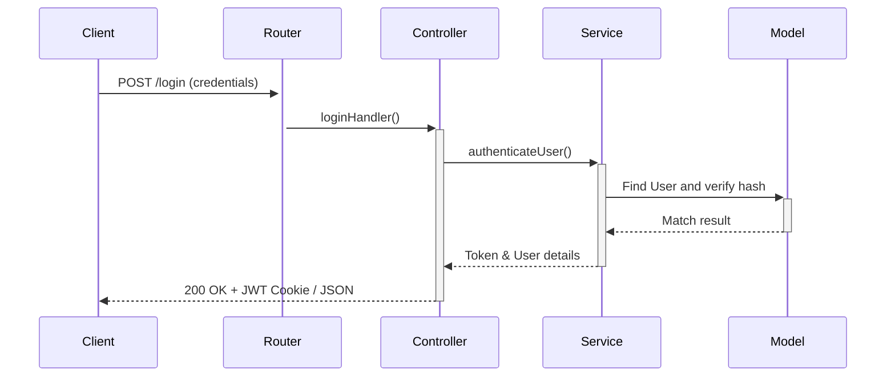

# Auth Module (Module 1)

This module handles session management, JWT issuing, role assignments, and authorization gatekeeping for E-Summit '26.

## Responsibilities
- User signup/registration for admins and volunteer coordinators.
- Security enforcement via JSON Web Tokens (JWT) stored in HTTP-Only secure cookies or parsed from Bearer headers.
- Middleware verification to lock down sensitive API paths (`requireAdmin`, `requireVolunteer`).

## Routes Setup
- `POST /api/auth/login` - Volunteer/Admin log-in.
- `POST /api/auth/logout` - Clear credentials.
- `POST /api/auth/register-volunteer` - Admin adds gateway scanner personnel.
- `GET /api/auth/me` - Profile context provider.

## Flow Diagrams

