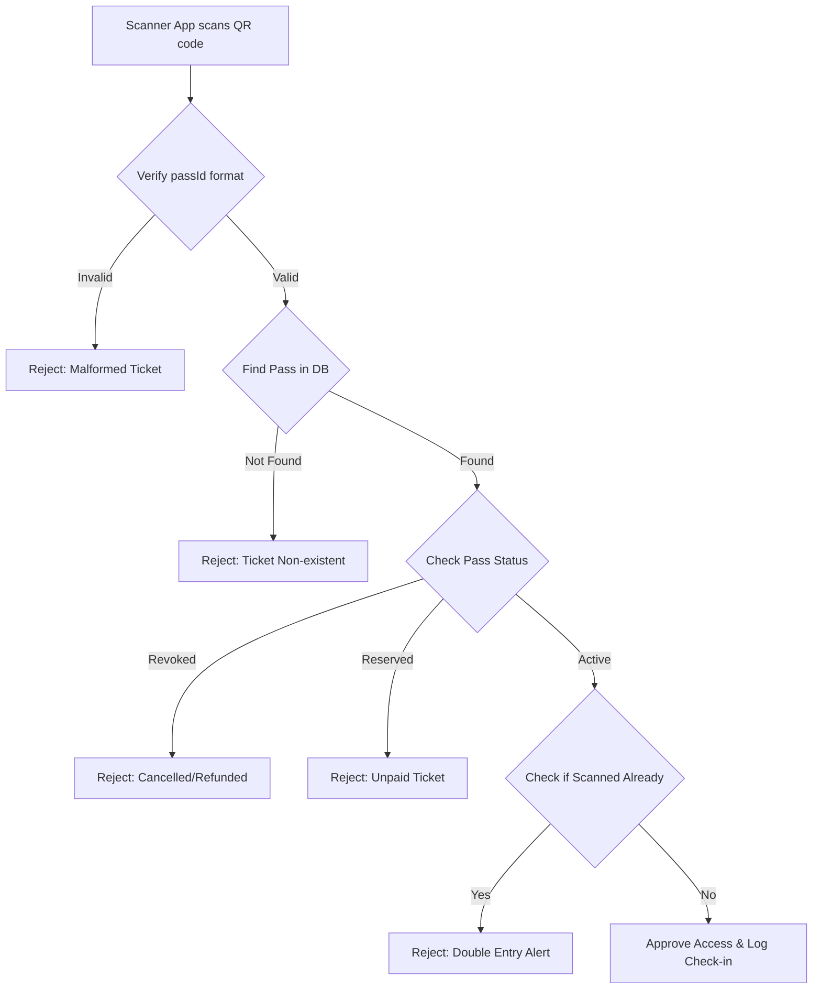

# Check-in Module (Module 5)

This module handles physical gate ticket validation, scanning logs, and analytics metrics of visitors entering the venue.

## Responsibilities
- Scan ticket credentials and check validity.
- Prevent double-entry (a ticket can only be checked in once).
- Log scanning events with volunteer IDs and gate tags for security/audit.

## Gateway Check Flow

## Routes
- `POST /api/checkin/scan` - Validate ticket QR code
- `GET /api/checkin/stats` - Fetch live dashboard analytics
