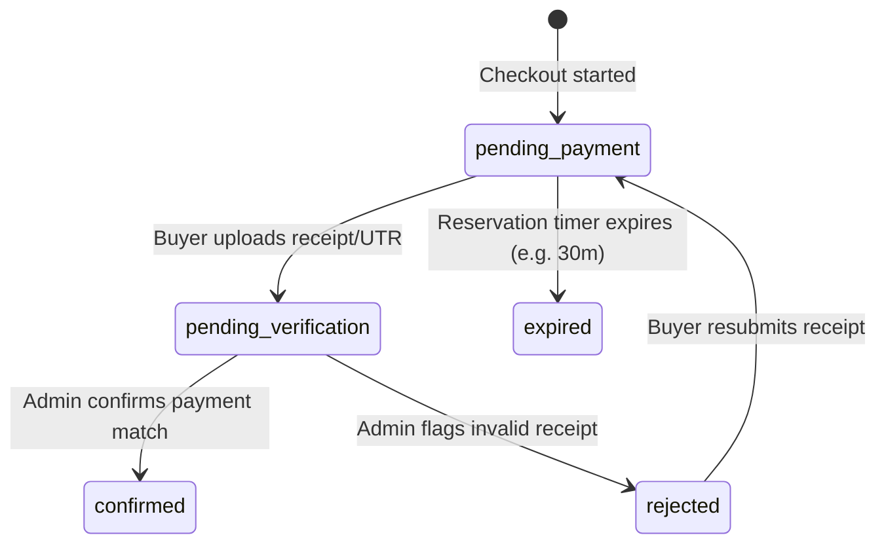

# Orders Module (Module 2)

This module manages ticket reservations, cart/ticket billing calculation, attendee detail associations, and the lifecycle of payments verification.

## Responsibilities
- Validate participant information (buyer + attendees).
- Reserve ticket allocations temporarily while awaiting payment.
- Record transaction references (UTR/receipts) uploaded by clients.
- Admin review triggers: manual verification/rejections.

## State Transitions

## Routes
- `POST /api/orders/checkout` - Create new ticket booking order
- `POST /api/orders/:id/payment` - Submit transaction screenshot & UTR
- `GET /api/orders/:id/status` - Look up status
- `PATCH /api/orders/:id/verify` - Admin confirmation endpoint
